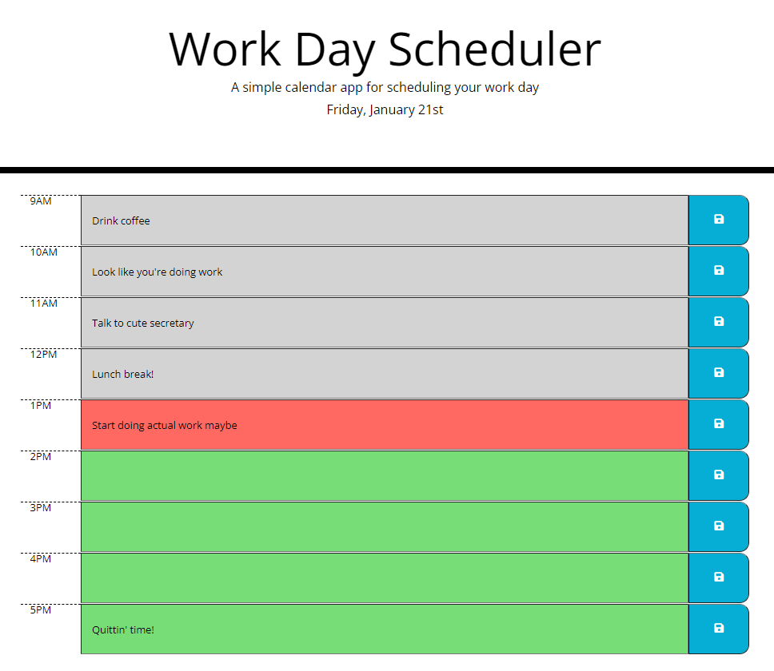

# Work Day Scheduler

## Organize your day with this work day scheduling application!
 - Input a task in the time block of your choosing (normal working hours of 9AM - 5PM).
 - Press the Save button at the end of the time block to save your input.
 - The colors of the time blocks will update as following: 
    - Gray: past
    - Red: present
    - Green: future

* **Warning!** Be sure you press the save button when finished editing a task, or your tasks will not be saved when you exit or refresh!

## Link to my GitHub account: [https://github.com/wingram1](https://github.com/wingram1) 